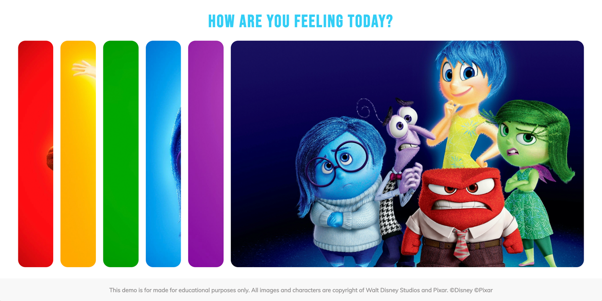

<p id="header"><p>

<table><tr>
<td> <a href="https://github.com/emjose/expand-search-two/#header"></a> </td>
<td> <a href="https://github.com/emjose/one-hundred/#header"></a> </td>
<td> <a href="https://github.com/emjose/blurry-loading/#header"></a> </td>
</tr></table>

<br>

<p id="project-title"><p>

<a href=#table-of-contents></a>

<br>

<a href="https://emjose.github.io/expanding-cards"></a>

#

<p id="table-of-contents"><p>

<a href=#table-of-contents></a>

-   [100 Days of Code](#100days)
-   [Installation](#installation)
-   [Live Site](#live-site)
-   [Resources](#resources)
-   [Copyright](#copyright)
-   [Let's Connect!](#lets-connect)

#

<p id="100days"><p>

<a href=#100days></a>

### Day 5: February 7, 2021

-   Growing up in an Asian and Filipino household, I was raised not to talk about my feelings.

-   Today, more teachers and educators are normalizing talking about your feelings in classrooms.

-   For Day 5, I turned a tutorial for accordion cards into a "How are you feeling today?" project.

-   The cards feature characters from one of my favorite films, <a href="https://www.pixar.com/feature-films/inside-out#inside-out-1">Inside Out</a>, by Disney and Pixar.

#

<p id="installation"><p>

<a href=#installation></a>

#### Git clone and cd into the repo folder:

```console
git clone git@github.com:emjose/expanding-cards.git && cd expanding-cards
```

#### Run the command:

```console
open index.html
```

#

<p id="live-site"><p>

<a href="https://emjose.github.io/expanding-cards"></a>

<a href="https://emjose.github.io/expanding-cards"></a>

#

<p id="resources"><p>

<a href=#resources></a>

-   #### [Google Fonts](https://fonts.google.com/)

-   #### [Pixar Inside Out Website](https://www.pixar.com/feature-films/inside-out#inside-out-1)

-   #### [Disney Inside Out Website](https://movies.disney.com/inside-out)

-   #### [50 Projects in 50 Days Udemy Course](https://www.udemy.com/course/50-projects-50-days/)

-   #### [Expanding Cards YouTube Tutorial](https://youtu.be/69FkUGpw3ok) by [Asish George Tech](https://www.youtube.com/channel/UC9v2BVgmJCQNN_RJKN6pZDw)

-   #### [My blog on how I created my Github READMEs](https://emmanueljose.medium.com/readme-a-makeover-story-b9c7be37a6de?sk=7ae6623d365409d875753e4604e42ffd)

#

<p id="copyright"><p>

<a href=#copyright></a>

-   This project is for made for educational purposes only.

-   All <a href="https://www.pixar.com/feature-films/inside-out#inside-out-1">Inside Out</a> images and characters are copyright of <a href="https://www.disney.com/">Disney</a> and <a href="https://www.pixar.com/">Pixar</a>. © Disney © Pixar. All Rights Reserved.

#

<p id="lets-connect"><p>

<a href=#lets-connect></a>

<p><a href="https://twitter.com/Emmanuel_Labor"></a> <a href="https://www.linkedin.com/in/emmanuelpjose/"></a> <a href="https://emmanueljose.medium.com/"></a> <a href="https://www.instagram.com/emmanuel_jose/"></a> <a href="mailto:emjose@gmail.com"></a> <a href="https://www.emmanuel-jose.com/"></a> <a href="https://github.com/emjose"></a></p>

#

<a href=#header></a>

<!-- https://stackoverflow.com/questions/4254389/git-corrupt-loose-object -->

<!-- removed corrupt loose object per Stackoverflow solutions -->
